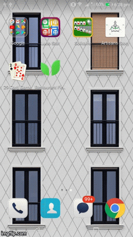
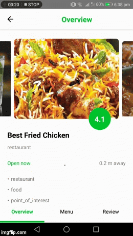

# Restaurant Finder

#### Restaurant finder is an app which lets you find your nearby restaurants , get to know more detail about them and direction to go there. You can also bookmark and search them. 

Download the APK : [Installable APK](https://github.com/ishraqe/restaurant/raw/master/apk/app-release.apk)

## Built With
 - [React Native](https://facebook.github.io/react-native/)
 - [Redux](https://github.com/reactjs/redux)

This is my second application built with react native. I built this to check out social authentication and google map's. For this app stores so little data so i used  [AsyncStorage](https://facebook.github.io/react-native/docs/asyncstorage.html). 

I would really appricate any suggestions, feedback, PRs and Issues.

## Walkthrough

In Singn in and Sign Up i [React native Facebook Sdk](https://github.com/facebook/react-native-fbsdk) and [React native Google SignIn](https://github.com/devfd/react-native-google-signin)  combining with Redux state control. 

Upon successful sign in or sign up, the user will be directed to the timeline page. These page are created using the [React native router flux](https://github.com/aksonov/react-native-router-flux). 
Chossing [React native router flux](https://github.com/aksonov/react-native-router-flux) was a tricky decision. 

The Home View is consists of Four tabs -

 - Home
 - Search
 - Map 
 - Bookmark 
 
These are swipeable tabs that are created by using the library [React native router flux](https://github.com/aksonov/react-native-router-flux). 

The top navigation bar comes also with it. There is also a drawer or side bar present there.  It consists of users name, image , location and Log out button. 

The "Home" component is a basically [Flat list](https://facebook.github.io/react-native/docs/flatlist.html).  All the data are coming from [Google Places API](https://developers.google.com/places/). 

The next "Map" component built with [React Native Maps](https://github.com/react-community/react-native-maps).

In and unfortunate event i didn't found any restaurants image, menu and menu image. So i used some dummy contents for them. 

 

### Debugging & crash-reporting:

Debugging of was pretty straight forward using the built in debug option. Rather than this i used [React native debugger](https://github.com/jhen0409/react-native-debugger), which gives me more flexibilty of debugging and waching over redux state. 

Upon installing the app i had faced some issues that caused the app crash and my bust my head of. By searching and asking on different communities i found some pretty good crash report tools. Among them i found love in [bugsnag](https://www.bugsnag.com/). They came up with some pretty good well formatted crash report. 

## How to create your own copy of this app?
### Prerequisites
To create an own copy of this application, you have some prerequisites. They are -

 - [NodeJS](https://nodejs.org/en/) installed on your system.
 - [React Native](https://facebook.github.io/react-native/) installed on your system.
 - Have the [Android SDK](https://developer.android.com/studio/index.html) and paths set properly. 
 - An android emulator or real device to run the app.

### Make own copy
First clone the repository using:

    git clone https://github.com/ishraqe/restaurant.git

Then install the dependencies using:

    npm install

Now there is some tricky business to handle. There will be some bugs i have found that comes with libraries. 
    For errors like 
    
    
    @Override method .....
 Go to the node 
 
    /node_modules/react-native-google-        signin/android/src/main/java/co/apptailor/googlesignin/RNGoogleSigninPackage.java  
And comment out or delete the @Override method in    
     
     createJSModules().    

    react-native run-android
Now, you have your own copy of this application!

If you get error like Metro blunder ...... try this command 

    rm ./node_modules/react-native/local-cli/core/__fixtures__/files/package.json

## License
Gimmi some cash !!, Kidding, Do whatever you want to do.

## Credits
For a noob like me creating an application of this stature woudn't have been possible without help of some awesome libraries i found.   

 - [React](https://facebook.github.io/react/)
 - [React Native](https://facebook.github.io/react-native/)
 - [React native FbSdk](https://github.com/facebook/react-native-fbsdk)
 - [React native google sign in](https://github.com/devfd/react-native-google-signin)
 - [React Native Vector Icons](https://github.com/oblador/react-native-vector-icons)
 - [Redux](https://github.com/reactjs/redux)
 - [React Redux](https://github.com/reactjs/react-redux)
 - [Redux thunk](https://github.com/gaearon/redux-thunk)
 - [React native linear gradient](https://github.com/react-native-community/react-native-linear-gradient) 
 - [React native router flux](https://github.com/aksonov/react-native-router-flux)
 - [React native video](https://github.com/react-native-community/react-native-video)
 - [React native svg ](https://github.com/react-native-community/react-native-svg)
 - [React native snap carousel](https://github.com/archriss/react-native-snap-carousel)
 - [React native scrollable tab view](https://github.com/skv-headless/react-native-scrollable-tab-view) 
 - [React native maps](https://github.com/react-community/react-native-maps)
 - [React native google places ](https://github.com/tolu360/react-native-google-places)
 - [React native communications ](https://github.com/anarchicknight/react-native-communications)

Made with ♥ by [Ishraqe Manjur](https://twitter.com/ishraqe_manjur)

